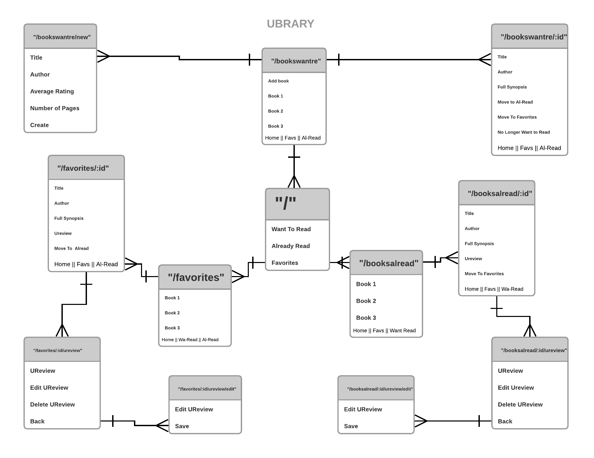

# Ubrary

Brian Martinez / February 26, 2018 

## Ubrary Proposal  

## Entity Relationship Diagram

## Wireframe 
    - You can choose whether you want to whiteboard the wireframes or use some program.

## User Stories  
    - [User stories](http://www.mariaemerson.com/user-stories/) that describe how your app will be used.

## Technology
	- link to API intend to use.
    - link to the NPM package intend to use.
    - Technology intend to use

## Timeline
    - A **timeline** laying out what going to do each day. This should specify clear features to be implemented by the end of each day.

## Obstacles
	- Foreseen challenges or obstacles

## Links and Resources   

https://www.lucidchart.com/

https://github.com/barndogghxc/ubrary